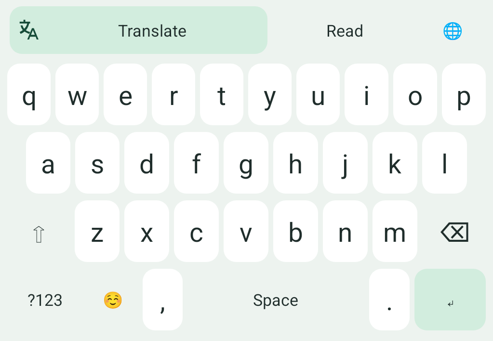
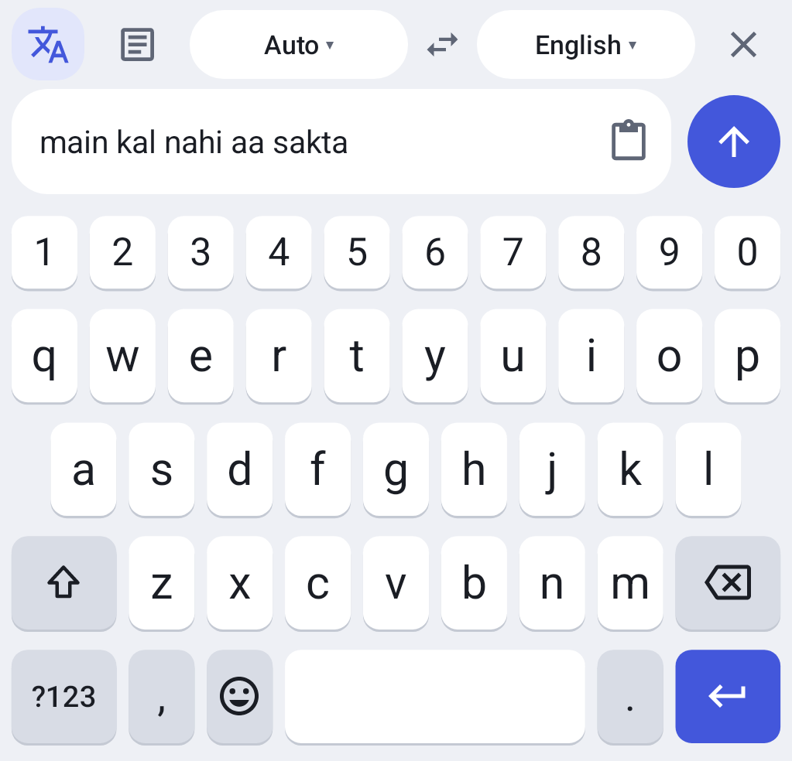
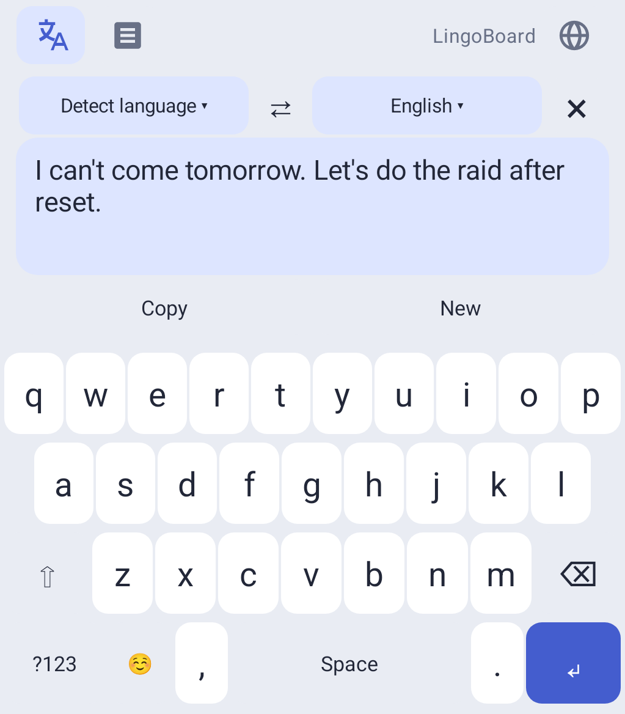
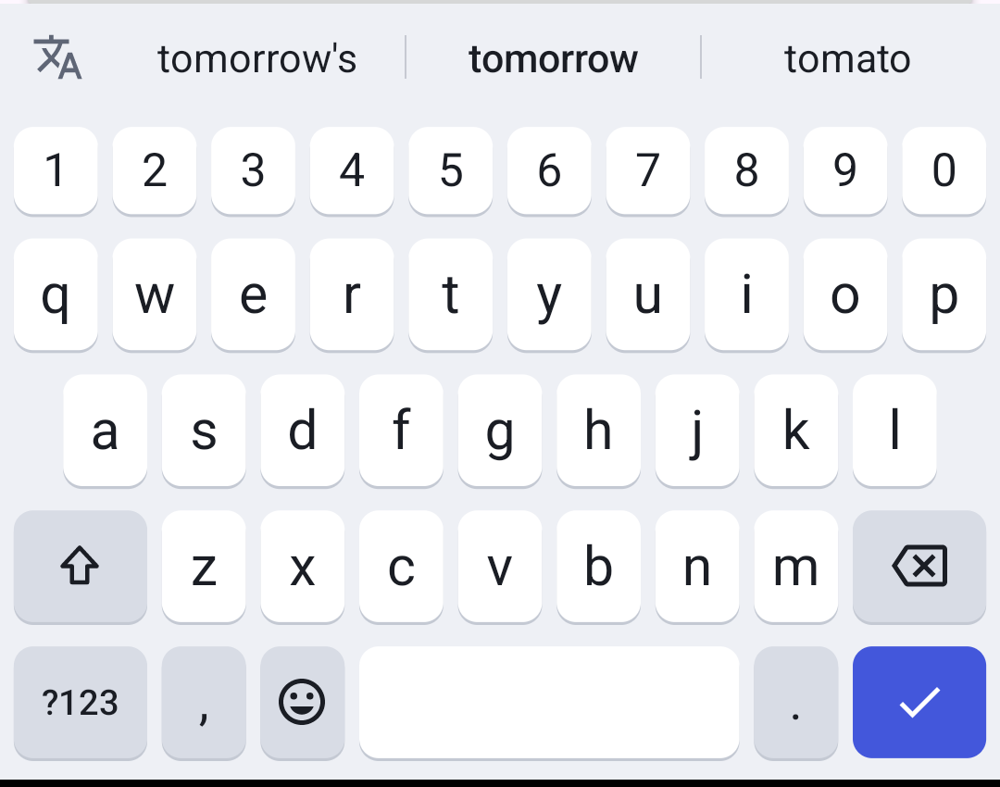

<p align="center">
  
</p>

<h1 align="center">LingoBoard</h1>

<p align="center">
  An Android keyboard that translates what you write and what you read, without leaving the chat.
</p>

<p align="center">
  
  
  
  
</p>

---

## Overview

LingoBoard is an Android input method with built-in translation. It covers **45 languages and
67 language/script options**, including all 22 scheduled Indian languages in both native script and
Roman characters (e.g. Hinglish). Translation is handled by Gemini through a small Cloudflare
Worker; typing and word suggestions run entirely on-device.

The source language defaults to **Detect language** and the target to **English**.

## Features

- **Write:** compose in a separate draft, tap **Translate & insert**, and the result is placed in
  the chat input. Nothing is ever sent automatically.
- **Read:** copy a received message, open the chat input and tap the message icon. The translation
  appears above the keys, leaving your own draft untouched.
- **Independent tabs:** Write and Read keep their own draft and result, so you can switch between
  them mid-conversation.
- **Translate selection:** select text in the active field and translate it in place.
- **Offline suggestions:** completions, typo corrections, next-word predictions and Roman Hindi
  vocabulary from bundled word lists, personalised from private on-device history.
- **Familiar layout:** five-row QWERTY with a number row, symbol and emoji pages, Caps Lock,
  key previews, haptics and multi-touch rollover. Follows the system light/dark theme.
- **No extra permissions:** keyboard translation needs no overlay permission or background session.

<p align="center">
  
  
  
  
</p>

More screenshots: [dark keyboard](docs/images/keyboard-typing-dark.png) ·
[dark reading](docs/images/keyboard-reading-dark.png) ·
[landscape](docs/images/keyboard-landscape.png) ·
[setup screen](docs/images/lingoboard-setup.png).
All are rendered on an emulator with synthetic sample text.

## Getting started

1. Install `LingoBoard-1.1.0.apk` (see [Build](#build) for where it is generated).
2. Open **LingoBoard**, tap **Enable LingoBoard**, then **Choose LingoBoard**.
3. Open any chat input and accept the one-time disclosure before your first translation.

Quick check: type `main kal nahi aa sakta` in the translation draft and tap **Translate & insert**.
English text should appear in the chat input without being sent.

The [phone testing guide](docs/BACKEND_SETUP.md#test-on-a-real-android-phone) covers every flow.

## Architecture

```text
┌──────────────────────┐   HTTPS    ┌──────────────────────────┐        ┌────────┐
│  Android IME (Kotlin)│ ─────────▶ │ Cloudflare Worker        │ ─────▶ │ Gemini │
│  typing, suggestions │            │ /v1/translate, /healthz  │        └────────┘
│  translation UI      │ ◀───────── │ D1 (SQLite) usage quotas │
└──────────────────────┘            └──────────────────────────┘
```

- Only the text being translated and the selected languages leave the device.
- The Gemini API key lives exclusively in Worker Secrets; the APK embeds only the public URL.
- No accounts, no stored translation history. Language detection happens in the same request.
- The shared test backend is rate-limited to **10 translations/minute and 200/UTC day** across all
  users, and runs on Gemini's free tier, so use non-sensitive text only.

See the [technical plan](docs/TECHNICAL_PLAN.md) for design details.

## Development

### Requirements

| Tool        | Version                     |
|-------------|-----------------------------|
| JDK         | 17                          |
| Android SDK | 34 (min API 23)             |
| Node.js     | 24+ (backend only)          |

### Configuration

```bash
cp backend.properties.example backend.properties
```

Set `BACKEND_URL` to the public HTTPS origin of your Worker. This value is compiled into the APK,
so **never** place API keys in it.

### Build

```bash
./gradlew :app:assembleDebug
```

The versioned APK is written to `app/build/outputs/apk/lingoboard/LingoBoard-<version>.apk`.

### Test

```bash
./gradlew :app:testDebugUnitTest :app:lintDebug :testhost:assembleWithQueriesDebug
```

```bash
npm --prefix backend test
```

If Gradle does not pick up JDK 17, prefix the command with
`JAVA_HOME=/opt/homebrew/opt/openjdk@17` (Homebrew on macOS).

### Backend

```bash
cd backend && cp .dev.vars.example .dev.vars && npm start
```

This serves the API on `127.0.0.1:8787` with a local SQLite database. Debug builds may call
`localhost`, `127.0.0.1` or `10.0.2.2` over HTTP; release builds require HTTPS.
Deployment to Cloudflare is documented in [BACKEND_SETUP.md](docs/BACKEND_SETUP.md).

## Project structure

```text
app/         Android keyboard, setup screen, selection actions and backend client
backend/     Cloudflare Worker / Node API, D1 quota schema, tests and smoke scripts
shared/      Language catalog shared by the app and backend
testhost/    Development-only host app for cross-process keyboard tests
benchmark/   Translation corpus, timing harness and recorded results
docs/        Product, architecture, validation and setup documentation
```

## Versioning

Releases follow semantic versioning and the APK is named `LingoBoard-<version>.apk`:

- **Patch** (`1.1.0 → 1.1.1`): fixes and polish
- **Minor** (`1.1.x → 1.2.0`): new features
- **Major** (`1.x → 2.0.0`): significant rewrites

`versionCode` is incremented on every release. The application ID never changes, so new builds
install over existing ones.

## Known limitations

- Target apps (WhatsApp, Telegram, Discord, Instagram, Game of Khans) still need verification on
  physical devices; behaviour varies by OEM and Android version.
- The keyboard cannot read text selected outside its active editor. Copy the message and use
  **Read** instead.
- The typing layout is Latin QWERTY only; other languages are translation targets, not native
  keyboard layouts.
- No autocorrect-on-space, swipe typing or voice input yet.
- Translation quality across all languages has not yet been reviewed by fluent speakers.

Current test evidence is tracked in the [validation plan](docs/VALIDATION_PLAN.md).

## Documentation

- [Product requirements](docs/PRODUCT_REQUIREMENTS.md)
- [Technical plan](docs/TECHNICAL_PLAN.md)
- [Validation plan](docs/VALIDATION_PLAN.md)
- [Backend setup & phone testing](docs/BACKEND_SETUP.md)
